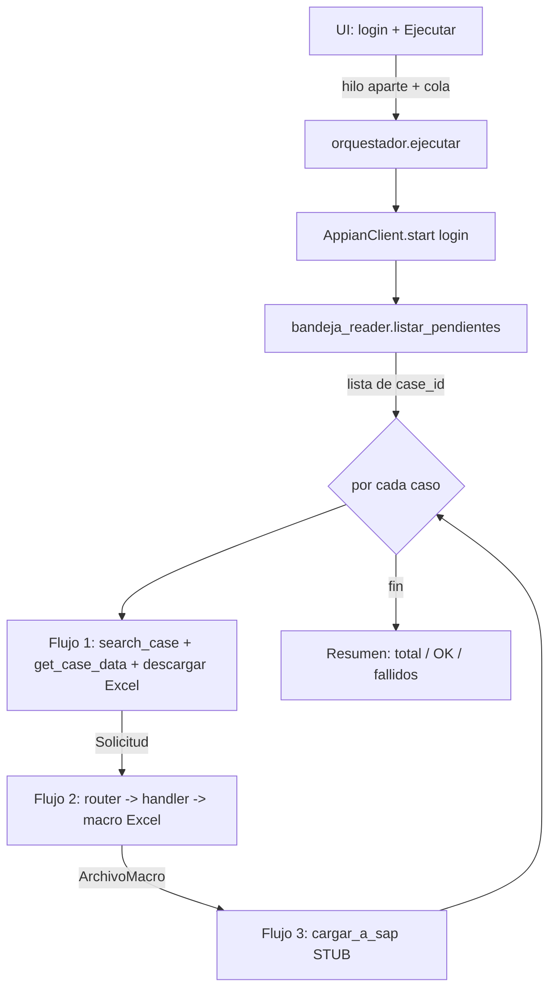

# ESTADO DEL PROYECTO — RPA "Parametrización de Activos Fijos"

> **Para qué sirve este archivo:** es la **bitácora viva** del proyecto. Está
> escrito para que **otra persona (u otro asistente/chat) pueda retomar el
> trabajo sin que se le explique nada de cero**. Si haces un cambio, **añade una
> entrada en el Changelog** (al final).

---

## 1. ¿Qué hace este bot? (propósito)

Automatiza la **parametrización de activos fijos** en Bancolombia. Ejecuta
**3 flujos encadenados**:

1. **Flujo 1 — Appian:** entra a Appian, lee la **Bandeja de Actividades**,
   identifica las solicitudes pendientes y, por cada una, abre el caso, lee su
   **tipo de activo** y **acción**, y **descarga el Excel adjunto**.
2. **Flujo 2 — Procesamiento:** toma ese Excel y lo transforma al **formato de la
   macro** que luego se carga a SAP (creación / modificación / eliminación).
3. **Flujo 3 — SAP:** carga el archivo a SAP. **Todavía NO implementado** (stub).

La usuaria final (no técnica) abre un **.exe** con interfaz gráfica, escribe sus
credenciales de Appian, presiona **Ejecutar** y ve el avance en una consola en vivo.

---

## 2. Estado actual (qué está hecho y qué no)

| Parte | Estado |
|---|---|
| UI (login + consola en vivo, hilo aparte + cola) | ✅ Hecho |
| Configuración central (`config.py`) | ✅ Hecho (con placeholders a completar) |
| Logging (archivo + consola UI, enmascara contraseñas) | ✅ Hecho |
| Wrapper de la librería Appian (valida `success`) | ✅ Hecho |
| Lector de la Bandeja (`bandeja_reader`) | ✅ Hecho, **con selectores placeholder** |
| Flujo 1 (bandeja → por caso: abrir + leer + descargar) | ✅ Hecho, **labels placeholder** |
| Flujo 2 (Excel Appian → macro SAP) | ✅ Hecho, **mapeo de columnas placeholder** |
| Caso especial Diferido + Creación (2 salidas AS01+AS02) | ✅ Hecho |
| Flujo 3 (SAP) | 🔲 Stub (pendiente a propósito) |
| Orquestador + resumen final | ✅ Hecho |
| Empaquetado `.exe` (`build.bat`) | ✅ Hecho (falta probarlo en un PC sin Python) |

**Lo que falta para que funcione de verdad** son datos del entorno real, no
código nuevo: URL de Appian, selectores de la bandeja, labels de los campos y el
mapeo de columnas. Todo eso está explicado en
[CONFIGURACION_MANUAL.md](CONFIGURACION_MANUAL.md).

---

## 3. Arquitectura y módulos

La regla de oro es la **separación de responsabilidades**:
**UI ↔ lógica (flujos) ↔ Appian ↔ transformación**. Y **se reutiliza** la
librería `an0016001_appian_flow` (login, navegación, descarga, formularios).

```
rpa_activos_fijos/
├── app.py                      # Punto de entrada: lanza la UI
├── config.py                   # ⚙️ Panel de control: URL, navegador, timeouts, rutas,
│                               #    selectores, labels, alias de negocio. NADA hardcodeado fuera de aquí.
├── requirements.txt
├── build.bat                   # Empaqueta a .exe con PyInstaller
├── assets/                     # logo.png, icon.ico, fondo.png (reutilizados de la UI de ejemplo)
│
├── ui/
│   ├── styles/theme.py         # Paleta Bancolombia, tema claro
│   ├── app_window.py           # Ventana principal + navegación + credenciales en memoria
│   └── views/
│       ├── login_view.py       # Credenciales de Appian + botón "Iniciar"
│       └── console_view.py     # Consola en vivo + botón "Ejecutar" (bot en hilo aparte + cola)
│
├── core/
│   ├── logger.py               # Logs → consola UI (cola) + archivo con timestamp. Enmascara contraseñas.
│   ├── exceptions.py           # Excepciones propias (CasoNoEncontrado, SinAdjuntos, etc.)
│   ├── retry.py                # Reintentos con backoff (decorador y función)
│   ├── models.py               # dataclasses: Solicitud, ArchivoMacro, ResultadoCaso, ResumenLote
│   └── texto.py                # Normalizar texto (minúsculas, sin tildes) para mapear tipo/acción
│
├── appian/
│   ├── appian_client.py        # Wrapper de AppianFlow: valida `success` y lanza excepciones propias
│   └── bandeja_reader.py       # NUEVO: lee la Bandeja de Actividades (selectores placeholder + respaldo)
│
├── flujos/
│   ├── flujo1_appian.py        # login → bandeja → por caso: search_case + get_case_data
│   ├── flujo2_procesar.py      # Excel Appian → formato macro SAP (usa el router)
│   └── flujo3_sap.py           # STUB: carga a SAP pendiente
│
├── transformacion/
│   ├── router.py               # (tipo, acción) → handler
│   ├── base_handler.py         # Interfaz común: leer Excel, guardar macro
│   ├── handlers/
│   │   ├── generico_handler.py # Patrón base: 1 entrada → 1 salida
│   │   └── diferidos_handler.py# Caso especial: Diferido + Creación → 2 salidas (AS01 + AS02)
│   └── mapping/
│       └── mapeo.py            # PLACEHOLDER del mapeo de columnas + plantillas de macro
│
├── orquestador.py              # Corre Flujo1 → Flujo2 → Flujo3(stub) por cada caso + resumen
├── downloads/                  # Excel descargados de Appian (runtime)
├── salidas/                    # Excel ya en formato macro (runtime)
├── logs/                       # Un log por ejecución (con timestamp)
└── docs/
    ├── ESTADO_PROYECTO.md      # este archivo
    └── CONFIGURACION_MANUAL.md # lo que hay que conseguir/configurar a mano
```

### Cómo fluyen los datos (resumen)



### Decisiones de diseño importantes

- **La librería no lanza excepciones**: devuelve `{success, message, data}`. Por
  eso `appian_client.py` valida `success` en **cada** llamada y lanza una
  excepción propia si falla. El resto del código usa `try/except` normal.
- **Aislamiento por caso**: en `orquestador._procesar_un_caso` cada caso va en su
  propio `try/except`. Un caso que falla se registra y **no detiene el lote**.
- **Cierre limpio**: el navegador se cierra **siempre** en un `finally`.
- **Nada hardcodeado**: URL, navegador, timeouts, selectores, labels y alias de
  negocio viven en `config.py`. El mapeo de columnas vive en
  `transformacion/mapping/`.
- **Selectores de respaldo**: `bandeja_reader` prueba varios XPath en orden
  (principal → alternativos) antes de fallar.
- **Concurrencia sin congelar la UI**: el bot corre en un `threading.Thread` y se
  comunica con la UI mediante `queue.Queue`; la UI la vacía con `after()`.
- **Seguridad**: las contraseñas nunca se escriben en logs (el logger las
  enmascara) y solo viven en memoria durante la ejecución.

---

## 4. Cómo correr el proyecto (desarrollo)

Requisitos: Python 3.9+, el entorno virtual `venv` con las dependencias (la
librería `an0016001_appian_flow` ya viene instalada ahí).

```powershell
# 1) Situarse en la carpeta del proyecto
cd rpa_activos_fijos

# 2) Activar el entorno virtual (está un nivel arriba)
..\venv\Scripts\activate

# 3) (si faltara algo) instalar dependencias
pip install -r requirements.txt

# 4) Ejecutar la app
python app.py
```

> Nota: sin la URL real de Appian y los selectores, el login fallará (es lo
> esperado). La UI, el logging y el Flujo 2 sí se pueden probar de una vez.

---

## 5. Cómo empaquetar a .exe

```powershell
cd rpa_activos_fijos
..\venv\Scripts\activate
build.bat
```

Genera `dist\RPA_Activos_Fijos\`. Esa **carpeta completa** es lo que se entrega a
la usuaria. Ver detalles y advertencias (driver de Edge, antivirus) en
[CONFIGURACION_MANUAL.md](CONFIGURACION_MANUAL.md), sección "Empaquetado".

---

## 6. Supuestos abiertos (PENDIENTES de confirmar)

1. **La usuaria recibe SOLO solicitudes de activos fijos** en su bandeja.
   → Si llegan mezcladas, activar `BANDEJA_FILTRAR_POR_TIPO` en `config.py` e
   implementar `_aplicar_filtro_tipo` en `bandeja_reader.py`.
2. **Los labels exactos** de "tipo de activo" y "acción" en el detalle del caso.
   → Están como placeholder en `LABELS_TIPO_ACTIVO` / `LABELS_ACCION`.
3. **Los selectores XPath** de la bandeja (fila, ID, filtro). → Placeholder en
   `BANDEJA_XPATH_*`.
4. **El mapeo de columnas** Appian → macro SAP por cada (tipo, acción).
   → Placeholder en `transformacion/mapping/mapeo.py`.
5. **El código real de la acción "eliminación"** (se asumió `ELIM`).
6. **El navegador** de la usuaria (se asume Edge).

---

## 7. Changelog

> Añade aquí una línea **cada vez** que cambies algo.

- **2026-07-23 — v0.1.0 — Base inicial.**
  - Scaffold completo del proyecto con separación UI/lógica/Appian/transformación.
  - `config.py` central con todos los parámetros y placeholders marcados.
  - `core/`: logger (archivo + cola UI, enmascara contraseñas), retry con backoff,
    excepciones propias, dataclasses, normalizador de texto.
  - `appian/appian_client.py`: wrapper que valida `success` y clasifica errores.
  - `appian/bandeja_reader.py`: lectura de la bandeja con selectores placeholder
    y de respaldo.
  - `flujos/`: Flujo 1 (bandeja + detalle + descarga), Flujo 2 (router + handlers),
    Flujo 3 (stub SAP).
  - Caso especial Diferido + Creación → 2 salidas (AS01 + AS02) verificado.
  - `orquestador.py`: encadena flujos por caso, aísla fallos, resumen final.
  - UI `customtkinter` tema claro: login + consola en vivo (hilo + cola).
  - `build.bat` (PyInstaller, modo carpeta) + `requirements.txt`.
  - Documentación: este archivo y `CONFIGURACION_MANUAL.md`.
  - Verificado: imports OK y Flujo 2 genera 1 salida (genérico) y 2 (diferido).
