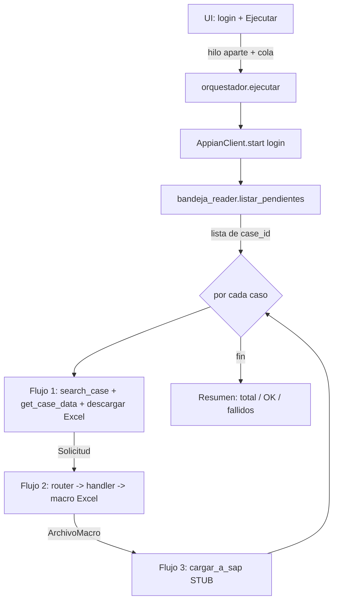

# ESTADO DEL PROYECTO — RPA "Parametrización de Activos Fijos"

> **Para qué sirve este archivo:** es la **bitácora viva** del proyecto. Está
> escrito para que **otra persona (u otro asistente/chat) pueda retomar el
> trabajo sin que se le explique nada de cero**. Si haces un cambio, **añade una
> entrada en el Changelog** (al final).

---

## 1. ¿Qué hace este bot? (propósito)

Automatiza la **parametrización de activos fijos** en Bancolombia. Ejecuta
**3 flujos encadenados**:

1. **Flujo 1 — Appian:** entra a Appian, lee la **Bandeja de Actividades**,
   identifica las solicitudes pendientes y, por cada una, abre el caso, lee su
   **tipo de activo** y **acción**, y **descarga el Excel adjunto**.
2. **Flujo 2 — Procesamiento:** toma ese Excel y lo transforma al **formato de la
   macro** que luego se carga a SAP (creación / modificación / eliminación).
3. **Flujo 3 — SAP:** carga el archivo a SAP. **Todavía NO implementado** (stub).

La usuaria final (no técnica) abre un **.exe** con interfaz gráfica, escribe sus
credenciales de Appian, presiona **Ejecutar** y ve el avance en una consola en vivo.

---

## 2. Estado actual (qué está hecho y qué no)

| Parte | Estado |
|---|---|
| UI (login + consola en vivo, hilo aparte + cola) | ✅ Hecho |
| Configuración central (`config.py`) | ✅ Hecho (con placeholders a completar) |
| Logging (archivo + consola UI, enmascara contraseñas) | ✅ Hecho |
| Wrapper de la librería Appian (valida `success`) | ✅ Hecho |
| Lector de la Bandeja (`bandeja_reader`) | ✅ Hecho, **con selectores placeholder** |
| Flujo 1 (bandeja → por caso: abrir + leer + descargar) | ✅ Hecho, **labels placeholder** |
| Flujo 2 (Excel Appian → macro SAP) | ✅ Hecho, **mapeo de columnas placeholder** |
| Caso especial Diferido + Creación (2 salidas AS01+AS02) | ✅ Hecho |
| Flujo 3 (SAP) | 🔲 Stub (pendiente a propósito) |
| Orquestador + resumen final | ✅ Hecho |
| Empaquetado `.exe` (`build.bat`) | ✅ Hecho (falta probarlo en un PC sin Python) |

**Lo que falta para que funcione de verdad** son datos del entorno real, no
código nuevo: URL de Appian, selectores de la bandeja, labels de los campos y el
mapeo de columnas. Todo eso está explicado en
[CONFIGURACION_MANUAL.md](CONFIGURACION_MANUAL.md).

---

## 3. Arquitectura y módulos

La regla de oro es la **separación de responsabilidades**:
**UI ↔ lógica (flujos) ↔ Appian ↔ transformación**. Y **se reutiliza** la
librería `an0016001_appian_flow` (login, navegación, descarga, formularios).

```
rpa_activos_fijos/
├── app.py                      # Punto de entrada: lanza la UI
├── config.py                   # ⚙️ Panel de control: URL, navegador, timeouts, rutas,
│                               #    selectores, labels, alias de negocio. NADA hardcodeado fuera de aquí.
├── requirements.txt
├── build.bat                   # Empaqueta a .exe con PyInstaller
├── assets/                     # logo.png, icon.ico, fondo.png (reutilizados de la UI de ejemplo)
│
├── ui/
│   ├── styles/theme.py         # Paleta Bancolombia, tema claro
│   ├── app_window.py           # Ventana principal + navegación + credenciales en memoria
│   └── views/
│       ├── login_view.py       # Credenciales de Appian + botón "Iniciar"
│       └── console_view.py     # Consola en vivo + botón "Ejecutar" (bot en hilo aparte + cola)
│
├── core/
│   ├── logger.py               # Logs → consola UI (cola) + archivo con timestamp. Enmascara contraseñas.
│   ├── exceptions.py           # Excepciones propias (CasoNoEncontrado, SinAdjuntos, etc.)
│   ├── retry.py                # Reintentos con backoff (decorador y función)
│   ├── models.py               # dataclasses: Solicitud, ArchivoMacro, ResultadoCaso, ResumenLote
│   └── texto.py                # Normalizar texto (minúsculas, sin tildes) para mapear tipo/acción
│
├── appian/
│   ├── appian_client.py        # Wrapper de AppianFlow: valida `success` y lanza excepciones propias
│   └── bandeja_reader.py       # NUEVO: lee la Bandeja de Actividades (selectores placeholder + respaldo)
│
├── flujos/
│   ├── flujo1_appian.py        # login → bandeja → por caso: search_case + get_case_data
│   ├── flujo2_procesar.py      # Excel Appian → formato macro SAP (usa el router)
│   └── flujo3_sap.py           # STUB: carga a SAP pendiente
│
├── transformacion/
│   ├── router.py               # (tipo, acción) → handler
│   ├── base_handler.py         # Interfaz común: leer Excel, guardar macro
│   ├── handlers/
│   │   ├── generico_handler.py # Patrón base: 1 entrada → 1 salida
│   │   └── diferidos_handler.py# Caso especial: Diferido + Creación → 2 salidas (AS01 + AS02)
│   └── mapping/
│       └── mapeo.py            # PLACEHOLDER del mapeo de columnas + plantillas de macro
│
├── orquestador.py              # Corre Flujo1 → Flujo2 → Flujo3(stub) por cada caso + resumen
├── downloads/                  # Excel descargados de Appian (runtime)
├── salidas/                    # Excel ya en formato macro (runtime)
├── logs/                       # Un log por ejecución (con timestamp)
└── docs/
    ├── ESTADO_PROYECTO.md         # este archivo
    ├── CONFIGURACION_MANUAL.md    # lo que hay que conseguir/configurar a mano
    └── GUIA_EXTRACCION_ETIQUETAS.md # cómo capturar selectores/etiquetas reales en Appian
```

### Cómo fluyen los datos (resumen)



### Decisiones de diseño importantes

- **La librería no lanza excepciones**: devuelve `{success, message, data}`. Por
  eso `appian_client.py` valida `success` en **cada** llamada y lanza una
  excepción propia si falla. El resto del código usa `try/except` normal.
- **Aislamiento por caso**: en `orquestador._procesar_un_caso` cada caso va en su
  propio `try/except`. Un caso que falla se registra y **no detiene el lote**.
- **Cierre limpio**: el navegador se cierra **siempre** en un `finally`.
- **Nada hardcodeado**: URL, navegador, timeouts, selectores, labels y alias de
  negocio viven en `config.py`. El mapeo de columnas vive en
  `transformacion/mapping/`.
- **Selectores de respaldo**: `bandeja_reader` prueba varios XPath en orden
  (principal → alternativos) antes de fallar.
- **Concurrencia sin congelar la UI**: el bot corre en un `threading.Thread` y se
  comunica con la UI mediante `queue.Queue`; la UI la vacía con `after()`.
- **Seguridad**: las contraseñas nunca se escriben en logs (el logger las
  enmascara) y solo viven en memoria durante la ejecución.

---

## 4. Cómo correr el proyecto (desarrollo)

Requisitos: Python 3.9+, el entorno virtual `venv` con las dependencias (la
librería `an0016001_appian_flow` ya viene instalada ahí).

```powershell
# 1) Situarse en la carpeta del proyecto
cd rpa_activos_fijos

# 2) Activar el entorno virtual (está un nivel arriba)
..\venv\Scripts\activate

# 3) (si faltara algo) instalar dependencias
pip install -r requirements.txt

# 4) Ejecutar la app
python app.py
```

> Nota: sin la URL real de Appian y los selectores, el login fallará (es lo
> esperado). La UI, el logging y el Flujo 2 sí se pueden probar de una vez.

---

## 5. Cómo empaquetar a .exe

```powershell
cd rpa_activos_fijos
..\venv\Scripts\activate
build.bat
```

Genera `dist\RPA_Activos_Fijos\`. Esa **carpeta completa** es lo que se entrega a
la usuaria. Ver detalles y advertencias (driver de Edge, antivirus) en
[CONFIGURACION_MANUAL.md](CONFIGURACION_MANUAL.md), sección "Empaquetado".

---

## 6. Supuestos abiertos (PENDIENTES de confirmar)

1. **La usuaria recibe SOLO solicitudes de activos fijos** en su bandeja.
   → Si llegan mezcladas, activar `BANDEJA_FILTRAR_POR_TIPO` en `config.py` e
   implementar `_aplicar_filtro_tipo` en `bandeja_reader.py`.
2. **Los labels exactos** de "tipo de activo" y "acción" en el detalle del caso.
   → Están como placeholder en `LABELS_TIPO_ACTIVO` / `LABELS_ACCION`.
3. **Los selectores XPath** de la bandeja (fila, ID, filtro). → Placeholder en
   `BANDEJA_XPATH_*`.
4. **El mapeo de columnas** Appian → macro SAP por cada (tipo, acción).
   → Placeholder en `transformacion/mapping/mapeo.py`.
5. **El código real de la acción "eliminación"** (se asumió `ELIM`).
6. **El navegador** de la usuaria (se asume Edge).

---

## 7. Changelog

> Añade aquí una línea **cada vez** que cambies algo.

- **2026-08-11 — Segunda prueba real: dos hallazgos más (IDs de Appian
  inestables + falta de espera en la bandeja).**
  - **Confirmado que la navegación directa (fix de ayer) funciona**: los 5
    casos de la corrida navegaron bien y `get_case_data()` descargó los
    adjuntos automáticamente (sin necesitar el respaldo manual).
  - **Hallazgo nuevo**: `DETALLE_XPATH_SECCION_ACTIVOS` (el XPath de la
    sección "Detalles") fallaba en el 100% de los casos con "no such
    element". El ID que se había capturado
    (`f868ae114fc7b69e3840a9e5db2ddaee_sectionContents`) es un ID que Appian
    genera **dinámicamente en cada render** — no es estable entre casos ni
    sesiones. Se cambió a buscar la sección por su **texto visible**
    ("Detalles"), con el mismo patrón que usa la librería internamente
    (`div[@role='region']` + `<h2>`), en vez de por ID.
  - ⚠️ `DETALLE_XPATH_BOTON_ADJUNTO_RESPALDO` usa el mismo patrón de ID
    hasheado y por lo tanto tiene el mismo riesgo — no se ha tocado porque
    no ha fallado (la descarga automática de la librería está funcionando),
    pero si algún día hace falta y falla, aplicar el mismo tipo de arreglo.
  - **Hallazgo nuevo**: la fecha de vencimiento llegó vacía (`None`) en
    los 5 casos de esta corrida (antes sí funcionaba). `bandeja_reader.py`
    no esperaba nada antes de leer la tabla; con internet más lento, lee la
    celda de fecha antes de que termine de poblarse. Se agregó
    `_esperar_fecha_cargada()`: espera (con el mismo `TIMEOUT` de
    `config.py`) a que la fecha de la primera fila esté poblada antes de
    leer toda la tabla.
  - `config.py`: `TIMEOUT` subido de 90 a 120 segundos, como colchón general
    para conexiones más lentas.
  - **Lección general para el resto del proyecto**: evitar XPath basados en
    IDs largos/hasheados de Appian (`id="xxxxxxxxxxxxxxxxxxxx_sectionContents"`),
    porque no son estables. Preferir selectores por texto visible o
    estructura (rol, encabezado), como ya se hace en `BANDEJA_XPATH_*`
    (que sí son estables, confirmado en dos corridas con casos distintos).

- **2026-08-10 — Primera prueba real: `search_case()` no sirve para estas
  solicitudes; se navega directo a la URL de la bandeja.**
  - **Hallazgo (con log real de una ejecución en Appian):** la bandeja se lee
    perfecto (7 solicitudes, filtro y orden por prioridad correctos), pero
    `AppianClient.search_case(case_id)` fallaba para el 100% de los casos con
    "No se encontró información para el caso X". Revisando el código fuente
    de la librería (`an0016001_appian_flow/cases_page.py`), se confirmó que
    `search_case()` busca en el módulo **"Seguimiento de Solicitudes"** de
    Appian — un módulo DISTINTO a la Bandeja de Actividades — donde estas
    tareas no aparecen. No es un bug de nuestro código ni de la librería, es
    el módulo equivocado para este caso de uso.
  - Se confirmó (leyendo `get_case_data()` en la librería) que **no depende
    de haber llamado `search_case()` antes**: solo lee lo que esté
    renderizado en pantalla en ese momento. Por eso la solución es navegar
    directo a la URL de cada solicitud.
  - `core/models.py`: `CasoBandeja` ahora también guarda `url` (el `href`
    del enlace del ID en la fila de la bandeja).
  - `appian/bandeja_reader.py`: `listar_pendientes()` captura ese `href`
    junto con el texto del ID (nuevo método `_texto_y_url_de`).
  - `flujos/flujo1_appian.py`: nueva función `_abrir_caso_directo()` que
    hace `client.driver.get(caso.url)` en vez de `client.search_case()`.
    `obtener_solicitud()` ahora recibe el `CasoBandeja` completo (antes
    recibía `case_id`/`fecha_vencimiento` sueltos).
  - `appian/appian_client.py`: documentado por qué `search_case()` no se usa
    en este flujo (se deja el wrapper por si algún flujo futuro sí lo
    necesita).
  - **Pendiente de confirmar en la próxima prueba:** que `get_case_data()`
    funcione bien navegando directo (su decorador `_require_app_ready()`
    espera un elemento de menú "Bandeja de Actividades"; si esa es una
    pestaña de navegación persistente del sitio, como sugiere la URL
    capturada, debería seguir presente en la página del caso).

- **2026-08-04 — Selectores/labels reales cargados + rediseño de detección
  de tipo/acción.**
  - `config.py`: `BANDEJA_XPATH_FILAS`, `BANDEJA_XPATH_ID_EN_FILA`,
    `BANDEJA_XPATH_NOMBRE_FLUJO` (nuevo) y `BANDEJA_XPATH_FECHA_VENCIMIENTO`
    (nuevo) ya tienen los XPath reales capturados en Appian. Se eliminó
    `BANDEJA_FILTRAR_POR_TIPO`/`BANDEJA_XPATH_FILTRO` (el filtro de UI que no
    se iba a usar) y se reemplazó por filtro directo de celda
    (`BANDEJA_NOMBRE_FLUJO_ESPERADO = "Parametrización de Activos"`).
  - `appian/bandeja_reader.py`: `listar_pendientes()` ahora filtra por
    "Nombre Del Flujo" y **ordena por "Fecha De Vencimiento"** (prioridad:
    vence antes, primero). Devuelve `List[CasoBandeja]` en vez de solo IDs.
  - **Rediseño de tipo/acción:** se descubrió que el detalle del caso NO
    tiene un campo único "Tipo de Activo" + "Acción" (como asumía el diseño
    original). Es una sección "Detalles" con 6 renglones fijos (Máscara,
    Activos BRP, Activos PRJ, Activos Diferidos y Renovaciones, Mejoras,
    Segunda Información); debajo de cada uno va la acción o un guion "-" si
    no aplica. Se eliminaron `LABELS_TIPO_ACTIVO`/`LABELS_ACCION`/
    `ALIAS_TIPO_ACTIVO`; se agregaron `DETALLE_XPATH_SECCION_ACTIVOS`,
    `LABELS_ACTIVOS_DETALLE`, `DETALLE_VALOR_VACIO` y `TIPO_SEGUNDA_INFO`.
  - `flujos/flujo1_appian.py`: nueva función
    `_extraer_tipo_y_accion_detalle()` que lee la sección "Detalles" con
    Selenium directo (`client.driver`) y toma el único renglón con acción
    real. Se confirmó con la usuaria que **solo debería haber uno a la vez**;
    si el bot encuentra más de uno, lanza `MultiplesActivosError` (nueva, en
    `core/exceptions.py`) y el caso queda marcado como fallido para revisión
    manual — **no se adivina**.
  - Descarga del Excel: se mantiene `get_case_data(download_attachments=True)`
    de la librería como método principal. Se agregó
    `_descargar_adjunto_manual()` como **respaldo**: si no hay adjunto
    usable, hace clic en `DETALLE_XPATH_BOTON_ADJUNTO_RESPALDO` y espera a
    que aparezca un archivo nuevo en `downloads/`. **Pendiente de probar en
    Appian real** cuál de los dos caminos se usa efectivamente.
  - `core/models.py`: nuevo `CasoBandeja` (case_id + fecha_vencimiento);
    `Solicitud` ahora también guarda `fecha_vencimiento`.
  - `orquestador.py`: `_procesar_un_caso` e `ejecutar()` ahora iteran sobre
    `CasoBandeja` en vez de solo el `case_id`, para poder pasar la fecha de
    vencimiento a lo largo del flujo.
  - Logging: cada caso deja una línea de log consolidada con case_id, fecha
    de vencimiento, activo y acción detectados (y la ruta del Excel).
  - **Supuesto pendiente de validar mañana en Appian real:** que el `.text`
    de Selenium sobre `DETALLE_XPATH_SECCION_ACTIVOS` efectivamente entrega
    el nombre del activo y su acción en líneas consecutivas, en ese orden.
    Si el parseo sale raro, revisar `_leer_lineas_seccion_activos()` en
    `flujo1_appian.py` primero.
  - Documentación: `CONFIGURACION_MANUAL.md` secciones 3 y 4 actualizadas
    con nota de "ya capturado" apuntando a este changelog.

- **2026-08-03 — Definiciones de la Bandeja de Actividades + nueva guía.**
  - Confirmado con la usuaria: la bandeja **sí trae solicitudes mezcladas**
    (no solo activos fijos), se filtra por la columna **"Nombre Del Flujo"**
    (valor esperado: "Parametrización de Activos"). Esto reemplaza el plan
    original de un filtro de UI (`BANDEJA_XPATH_FILTRO`) por un filtro **por
    valor de celda**, más simple y robusto (pendiente de implementar en
    `bandeja_reader.py` cuando lleguen los selectores reales).
  - Se añade **priorización**: la bandeja tiene columna **"Fecha de
    Vencimiento"**; los casos deben procesarse en orden de vencimiento (más
    próximo primero). Pendiente de implementar el ordenamiento en
    `listar_pendientes()`.
  - Confirmado que el ID del caso (columna **"Numero De La Solicitud"**, ej.
    `PDA-7133`) es clicable y coincide con el patrón ya soportado
    (`BANDEJA_XPATH_ID_EN_FILA` + `BANDEJA_REGEX_CASE_ID`). No se necesita
    interactuar con el botón "Acceso Actividad Actual"; basta con extraer el
    ID como texto y usar `client.search_case(case_id)` como ya está.
  - Nuevo documento [GUIA_EXTRACCION_ETIQUETAS.md](GUIA_EXTRACCION_ETIQUETAS.md):
    guía paso a paso para que la usuaria/desarrollador capture los XPath de
    la bandeja y las etiquetas del detalle del caso, con plantilla de entrega.
  - **Nota:** todavía no se tocó código (`config.py` / `bandeja_reader.py`);
    se está a la espera de que lleguen los selectores y etiquetas reales
    siguiendo la nueva guía.

- **2026-07-23 — v0.1.0 — Base inicial.**
  - Scaffold completo del proyecto con separación UI/lógica/Appian/transformación.
  - `config.py` central con todos los parámetros y placeholders marcados.
  - `core/`: logger (archivo + cola UI, enmascara contraseñas), retry con backoff,
    excepciones propias, dataclasses, normalizador de texto.
  - `appian/appian_client.py`: wrapper que valida `success` y clasifica errores.
  - `appian/bandeja_reader.py`: lectura de la bandeja con selectores placeholder
    y de respaldo.
  - `flujos/`: Flujo 1 (bandeja + detalle + descarga), Flujo 2 (router + handlers),
    Flujo 3 (stub SAP).
  - Caso especial Diferido + Creación → 2 salidas (AS01 + AS02) verificado.
  - `orquestador.py`: encadena flujos por caso, aísla fallos, resumen final.
  - UI `customtkinter` tema claro: login + consola en vivo (hilo + cola).
  - `build.bat` (PyInstaller, modo carpeta) + `requirements.txt`.
  - Documentación: este archivo y `CONFIGURACION_MANUAL.md`.
  - Verificado: imports OK y Flujo 2 genera 1 salida (genérico) y 2 (diferido).
