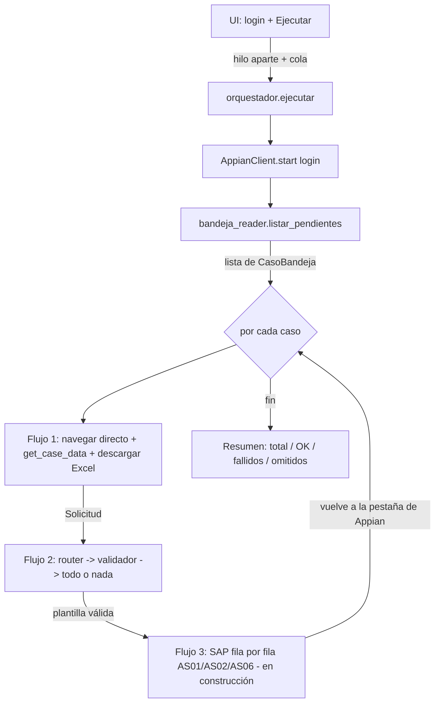

# ESTADO DEL PROYECTO — RPA "Parametrización de Activos Fijos"

> **Para qué sirve este archivo:** es la **bitácora viva** del proyecto. Está
> escrito para que **otra persona (u otro asistente/chat) pueda retomar el
> trabajo sin que se le explique nada de cero**. Si haces un cambio, **añade una
> entrada en el Changelog** (al final).

---

## 1. ¿Qué hace este bot? (propósito)

Automatiza la **parametrización de activos fijos** en Bancolombia. Por cada
solicitud de la Bandeja de Actividades de Appian:

1. **Flujo 1 — Appian:** lee la **Bandeja de Actividades** (solo
   "Parametrización de Activos", por fecha de vencimiento), abre cada
   solicitud, identifica **tipo de activo** y **acción** (sección "Detalles")
   y **descarga el Excel adjunto**.
2. **Flujo 2 — Validación:** el Excel del usuario se valida fila por fila con
   las reglas de cada (tipo de activo, acción). Regla **todo o nada**: si una
   fila es inválida, la solicitud no sigue a SAP.
3. **Flujo 3 — SAP, activo por activo:** cada fila del Excel es UN activo. El
   bot abre la transacción individual (**AS01** crear / **AS02** modificar /
   **AS06** borrar) y **llena el formulario** con los valores de esa fila.
   SAP **no** recibe el archivo (cambio de negocio 2026-10-04: ya no hay carga
   ni modificación masiva). Si una fila falla en SAP, se anota el mensaje y se
   **continúa** con la siguiente.
4. **Respuesta en Appian:** en la misma solicitud, comentario parametrizado +
   el Excel del usuario con una columna nueva **"Código SAP"** (el código del
   activo creado, o el mensaje de error de SAP en esa fila), y cierre
   Finalizado Exitoso / No Exitoso.

**Diseño acordado de ejecución (2026-09-27, pendiente de implementar):**
(1) Preparación: leer bandeja → descargar TODOS → validar TODOS; (2) uno por
uno (válidos, por vencimiento): SAP → columna "Código SAP" → responder en
Appian. La llave de todo es el `case_id`; se guardará una **bitácora de
estado** por solicitud y **por fila** en disco para reanudar sin crear
activos duplicados en SAP.

**Seguridad (no hay SAP de pruebas):** "Guardar" en SAP crea/modifica/borra
activos REALES → interruptor `SAP_GUARDAR_REAL = False` (el bot llena el
formulario y se detiene antes de Guardar; botón "Continuar" en la ventana del
bot). En **modo pruebas**, guardar está **prohibido** aunque el interruptor
esté encendido. Finalizar en Appian: `APPIAN_RESPONDER_REAL = False`.

**Método de trabajo:** activo por activo y acción por acción. En curso:
**BRP – Creación (AS01)**. Las plantillas oficiales y el Word de proceso de
cada activo viven en `plantillas/<ACTIVO>/` (raíz del repo). Lo que falta,
detallado, está en [PENDIENTES.md](PENDIENTES.md).

La usuaria final (no técnica) abre un **.exe** con interfaz gráfica, escribe sus
credenciales de Appian, presiona **Ejecutar** y ve el avance en una consola en vivo.

---

## 2. Estado actual (qué está hecho y qué no)

| Parte | Estado |
|---|---|
| UI (login + consola en vivo, hilo aparte + cola) | ✅ Hecho |
| Configuración central (`config.py`) | ✅ Hecho (`APPIAN_URL` sigue como placeholder en el repo) |
| Logging (archivo + consola UI, enmascara contraseñas) | ✅ Hecho |
| Wrapper de la librería Appian (valida `success`) | ✅ Hecho |
| Lector de la Bandeja (`bandeja_reader`) | ✅ Probado en real · 🔲 paginación (P12) |
| Flujo 1 (bandeja → abrir → tipo/acción → descargar) | ✅ Probado en real |
| Modo pruebas REEMPLAZO (Appian real + tu Excel) | ✅ Hecho ([GUIA_MODO_PRUEBAS.md](GUIA_MODO_PRUEBAS.md)) |
| Modo pruebas SOLO SAP (sin Appian: tu Excel → validación → SAP) | ✅ Hecho ([GUIA_MODO_PRUEBAS.md](GUIA_MODO_PRUEBAS.md)) |
| Flujo 2: motor de validación + BRP – Creación (A..AC) | ✅ Hecho + pruebas |
| Validación de otros activos/acciones | 🔲 Uno a uno (AS02/AS06 tendrán plantilla propia) |
| SAP: base (pestaña, login, transacción, clics, iframes) | ✅ Hecho (`sap/sap_webgui.py`) |
| SAP: interruptor de guardar + bloqueo en modo pruebas | ✅ Hecho (`flujo3_sap.guardar_permitido`) |
| SAP: formulario AS01 por configuración (BRP – Creación) | ✅ Hecho (3 dudas abiertas, PENDIENTES P3) |
| SAP: supervisión (se detiene antes de Guardar + botón "Continuar (sin guardar)") | ✅ Hecho |
| SAP: leer código / error y columna "Código SAP" | ✅ Código listo · 🔲 falta XPath del mensaje (P5) |
| Bitácora de estado por solicitud y por fila | 🔲 Pendiente (prioritaria) |
| Respuesta en Appian | 🔲 Pendiente (selectores capturados) |
| Orquestador + resumen final | ✅ Hecho |
| Empaquetado `.exe` (`build.bat`) | ✅ Hecho (falta probarlo en un PC sin Python) |

---

## 3. Arquitectura y módulos

La regla de oro es la **separación de responsabilidades**:
**UI ↔ lógica (flujos) ↔ Appian ↔ validación ↔ SAP**. Y **se reutiliza** la
librería `an0016001_appian_flow` (login, navegación, descarga, formularios).

```
rpa_activos_fijos/
├── app.py                      # Punto de entrada: lanza la UI
├── config.py                   # ⚙️ Panel de control: URLs, navegador, timeouts, rutas,
│                               #    selectores, interruptores. NADA hardcodeado fuera de aquí.
├── requirements.txt
├── build.bat                   # Empaqueta a .exe con PyInstaller
├── assets/                     # logo.png, icon.ico, fondo.png
│
├── ui/
│   ├── styles/theme.py         # Paleta Bancolombia, tema claro
│   ├── app_window.py           # Ventana principal + navegación + credenciales en memoria
│   └── views/
│       ├── login_view.py       # Credenciales de Appian + botón "Iniciar"
│       └── console_view.py     # Consola en vivo (bot en hilo aparte + cola) + botón "Continuar (sin guardar)"
│
├── core/
│   ├── logger.py               # Logs → consola UI (cola) + archivo con timestamp. Enmascara contraseñas.
│   ├── exceptions.py           # Excepciones propias (Appian, Validación, SapError, CasoOmitido...)
│   ├── retry.py                # Reintentos con backoff (decorador y función)
│   ├── models.py               # dataclasses: CasoBandeja, Solicitud, ResultadoFila/Validacion, ResultadoCaso, ResumenLote
│   └── texto.py                # Normalizar texto (minúsculas, sin tildes)
│
├── appian/
│   ├── appian_client.py        # Wrapper de AppianFlow: valida `success` y lanza excepciones propias
│   └── bandeja_reader.py       # Lee la Bandeja de Actividades (filtro, prioridad, href de cada fila)
│
├── flujos/
│   ├── flujo1_appian.py        # bandeja → por caso: navegar directo + get_case_data + tipo/acción (+ MODO PRUEBAS)
│   ├── modo_solo_sap.py        # MODO PRUEBAS SOLO SAP: Excel de downloads_test en vez de Appian
│   ├── flujo2_validar.py       # Valida la plantilla (usa validacion/router); todo o nada
│   └── flujo3_sap.py           # SAP activo por activo: formulario por config, supervisión, "Código SAP"
│
├── validacion/
│   ├── router.py               # (tipo, acción) → validador. Sin validador = el caso no se procesa
│   ├── base_validador.py       # Motor común: 1ª hoja, columnas por ENCABEZADO, obligatorios,
│   │                           #   estructura, largos (aviso o error), filas vacías
│   └── plantillas/
│       └── brp_creacion.py     # BRP – Creación: A..AC + cantidad=1 + vehículos + AC ≤ 50
│
├── sap/
│   └── sap_webgui.py           # SAP en el navegador: pestaña, login, transacción, clics/escritura (iframes)
│
├── tests/                      # pytest: `python -m pytest tests -q` (usa plantillas/ de la raíz)
│
├── orquestador.py              # Flujo1 → Flujo2 → Flujo3 por cada caso; vuelve a Appian; resumen
├── downloads/                  # Excel descargados de Appian (runtime)
├── downloads_test/             # MODO PRUEBAS: Excel preparados a mano (PDA-7889.xlsx/.xlsm)
├── salidas/                    # (futuro) Excel con "Código SAP" para responder (runtime)
├── logs/                       # Un log por ejecución (con timestamp)
└── docs/
    ├── ESTADO_PROYECTO.md         # este archivo
    ├── PENDIENTES.md              # TODO lo que falta, detallado
    ├── GUIA_MODO_PRUEBAS.md       # paso a paso para probar + qué hace cada interruptor
    ├── CONFIGURACION_MANUAL.md    # lo que hay que conseguir/configurar a mano
    └── GUIA_EXTRACCION_ETIQUETAS.md # cómo capturar selectores/etiquetas reales en Appian
```

### Cómo fluyen los datos (resumen)


```mermaid
flowchart TD
    UI[UI: login + Ejecutar] -->|hilo aparte + cola| ORQ[orquestador.ejecutar]
    ORQ --> C[AppianClient.start login]
    C --> B[bandeja_reader.listar_pendientes]
    B -->|lista de CasoBandeja| LOOP{por cada caso}
    LOOP --> F1[Flujo 1: navegar directo + get_case_data + descargar Excel]
    F1 -->|Solicitud| F2[Flujo 2: router -> validador -> todo o nada]
    F2 -->|plantilla válida| F3[Flujo 3: SAP fila por fila AS01/AS02/AS06 - en construcción]
    F3 -->|vuelve a la pestaña de Appian| LOOP
    LOOP -->|fin| R[Resumen: total / OK / fallidos / omitidos]
```

### Decisiones de diseño importantes

- **La librería no lanza excepciones**: devuelve `{success, message, data}`. Por
  eso `appian_client.py` valida `success` en **cada** llamada y lanza una
  excepción propia si falla. El resto del código usa `try/except` normal.
- **Aislamiento por caso**: en `orquestador._procesar_un_caso` cada caso va en su
  propio `try/except`. Un caso que falla se registra y **no detiene el lote**.
  En SAP, además, una **fila** que falla no detiene las demás filas.
- **Cierre limpio**: el navegador se cierra **siempre** en un `finally`, y tras
  cada caso se vuelve a la pestaña de Appian.
- **Nada hardcodeado**: URLs, navegador, timeouts, selectores, interruptores y
  alias de negocio viven en `config.py`.
- **Selectores en lista (principal → respaldos)** en Appian y SAP. En Appian se
  prefieren selectores por texto visible o estructura (los IDs largos que genera
  Appian son inestables); en SAP los IDs (`ToolbarOkCode`, `M0:46:...`) son
  estables por pantalla.
- **Seguridad en sistemas reales**: interruptores en `False` por defecto
  (`SAP_GUARDAR_REAL`, `APPIAN_RESPONDER_REAL`) y bloqueo de guardado en modo
  pruebas.
- **Concurrencia sin congelar la UI**: el bot corre en un `threading.Thread` y se
  comunica con la UI mediante `queue.Queue`; la UI la vacía con `after()`.
- **Contraseñas**: nunca se escriben en logs (el logger las enmascara) y solo
  viven en memoria durante la ejecución.

---

## 4. Cómo correr el proyecto (desarrollo)

Requisitos: Python 3.9+, el entorno virtual `venv` con las dependencias (la
librería `an0016001_appian_flow` ya viene instalada ahí).

```powershell
# 1) Situarse en la carpeta del proyecto
cd rpa_activos_fijos

# 2) Activar el entorno virtual (está un nivel arriba)
..\venv\Scripts\activate

# 3) (si faltara algo) instalar dependencias
pip install -r requirements.txt

# 4) Ejecutar la app
python app.py
```

> Nota: sin la URL real de Appian y los selectores, el login fallará (es lo
> esperado). La UI, el logging y el Flujo 2 sí se pueden probar de una vez.

---

## 5. Cómo empaquetar a .exe

```powershell
cd rpa_activos_fijos
..\venv\Scripts\activate
build.bat
```

Genera `dist\RPA_Activos_Fijos\`. Esa **carpeta completa** es lo que se entrega a
la usuaria. Ver detalles y advertencias (driver de Edge, antivirus) en
[CONFIGURACION_MANUAL.md](CONFIGURACION_MANUAL.md), sección "Empaquetado".

---

## 6. Supuestos abiertos (PENDIENTES de confirmar)

> La lista completa y detallada está en [PENDIENTES.md](PENDIENTES.md).

1. **El navegador** de la usuaria (se asume Edge).
2. **Login de SAP**: IDs estándar (`sap-user`, `sap-password`,
   `LOGON_BUTTON`) — por confirmar en la 1ª prueba real.
3. **Plantilla inválida: ¿se le devuelven al usuario las observaciones por
   fila?** Lo confirma el usuario funcional. Mientras tanto el caso queda
   FALLIDO con el detalle por fila en el log.
4. **Bandeja paginada** (P12): hoy solo se lee la página visible.

---

## 7. Changelog

> Añade aquí una línea **cada vez** que cambies algo.

- **2026-10-05 (2) — Nuevo MODO PRUEBAS SOLO SAP (sin Appian).**
  - Motivo: poder probar la validación y AS01 en SAP cuando no hay
    solicitudes de BRP en la bandeja de Appian.
  - `config.py`: `MODO_PRUEBAS_SOLO_SAP = False`. Excluyente con
    `MODO_PRUEBAS_REEMPLAZO` (si ambos están en True, el bot no arranca).
  - Archivos: `downloads_test/<id>_<tipo>_<accion>.xlsx|.xlsm` (ej.
    `prueba1_brp_creacion.xlsx`); el tipo y la acción salen del nombre
    (canónicos de config.py; no distingue mayúsculas). Otros nombres →
    omitidos con aviso. Nuevo `flujos/modo_solo_sap.py`.
  - `orquestador.py` reorganizado: `_procesar()` común (obtener solicitud →
    Flujo 2 → Flujo 3, mismo manejo de errores), `_ejecutar_con_appian()`
    (recorrido normal, sin cambios de comportamiento) y `_ejecutar_solo_sap()`
    (crea `AppianClient` SOLO para abrir el navegador, sin `start()`). El
    navegador se cierra siempre (también si falla el login de Appian),
    usando un contenedor explícito en vez de variables sueltas.
  - `flujo3_sap.guardar_permitido()`: False también en modo solo SAP.
  - Pruebas: `tests/test_modo_solo_sap.py` (nombres, guardar prohibido,
    modos excluyentes, recorrido completo sin Appian: no inicia sesión,
    cierra navegador, "Continuar" por fila, nunca guarda, archivo intacto,
    sin archivos no abre navegador) → 79 OK.
  - GUIA_MODO_PRUEBAS.md: nueva sección 0 "¿Qué modo uso?", interruptor en
    la sección 3, nueva sección 5 (paso a paso del modo solo SAP), checklist
    y problemas comunes de ambos modos.

- **2026-10-05 — AS01 (BRP – Creación) por configuración + supervisión con
  botón "Continuar".**
  - `config.py`: `SAP_FORMULARIO_AS01_BRP` (XPath entregados por el usuario:
    pantalla inicial A/B/C → Enter → D, AC, F, G → 4 pestañas con doble clic
    lento → H..N, O..R, S..V, W..X), `SAP_FORMULARIOS_POR_CASO`,
    `SAP_ESPERA_ENTRE_CLICS_SEG = 2`, `SAP_FORMATO_FECHA` y
    `SAP_SEPARADOR_DECIMAL` (por confirmar), `SAP_XPATH_MENSAJE_ESTADO = []`
    (pendiente), `SAP_REGEX_ACTIVO_CREADO` ("El act.fj. 7129560 0 se ha
    creado" → 7129560), `SAP_XPATH_BOTON_ATRAS` y
    `SAP_XPATH_CONFIRMAR_SALIR_SIN_GUARDAR`.
  - `flujo3_sap.cargar_a_sap()`: fila por fila → `/nAS01` → llenar (celdas
    vacías no se tocan; casilla solo si trae valor) → si `guardar_permitido()`
    Guardar + leer código/error, si no: se detiene, pide "Continuar" y sale
    SIN guardar (Atrás ×2 + confirmar). Error en una fila → `ERROR: ...` en
    `Solicitud.resultados_sap` y se continúa (sin presionar Atrás).
    Seguridad extra: nunca guarda si `SAP_XPATH_MENSAJE_ESTADO` está vacío.
    `escribir_columna_codigo_sap()` → `salidas/<archivo>_RESPUESTA.<ext>`
    con "Código SAP" (solo cuando se guarda de verdad).
  - `sap/sap_webgui.py`: `enter()`, `doble_clic_lento()`, `existe()` (espera
    corta, no lanza), `leer_texto()`.
  - `validacion/base_validador.py`: `leer_filas()` (misma lógica que la
    validación; la usa SAP). El log ahora dice "Validando ... con la
    plantilla" / "Leyendo filas de ... con la plantilla".
  - `ui/views/console_view.py`: botón **"Continuar (sin guardar)"**. El bot
    avisa por la COLA (no toca widgets desde su hilo: la primera versión con
    `after()` desde el hilo del bot falló en la prueba de humo) y espera un
    `threading.Event`. `orquestador.ejecutar(..., esperar_continuar=...)`.
  - Pruebas: nuevo `tests/test_sap_as01.py` (SAP falso: orden de campos,
    vacíos, casilla, nunca guarda en supervisión ni en MODO PRUEBAS, sin
    XPath del mensaje no guarda, error en fila y continúa, códigos +
    columna "Código SAP") + 3 en `test_sap_webgui.py` → 68 OK. Simulación
    completa por el orquestador OK (2 "Continuar", Guardar nunca). Prueba
    de humo de la ventana real: el botón se habilita, libera al bot y se
    vuelve a deshabilitar.
  - Docs: GUIA_MODO_PRUEBAS.md (qué hace en SAP, qué revisar en cada pausa,
    ajustes, errores) y PENDIENTES.md (P3 y P4 ✅, P5 código listo).
  - Decisión del usuario (mismo día): solo se llenan los campos de los XPath
    entregados; columnas sin XPath (E, Y, Z, AA, AB) se ignoran; campos sin
    columna ("Cantidad", "Total depreciados") no se llenan; celda vacía → el
    campo no se toca. Coincide con lo implementado (solo comentarios/docs).

- **2026-10-04 — CAMBIO DE NEGOCIO: no hay carga masiva. SAP se trabaja
  activo por activo con AS01 / AS02 / AS06. Se retira todo lo de la masiva.**
  - Decisión de negocio: la carga masiva (`Z_AM_MASIVA`) y la modificación
    masiva no se pueden usar. Cada fila del Excel es un activo y se crea /
    modifica / borra con la transacción individual, llenando el formulario
    con los valores de la fila. El Excel del usuario sigue IGUAL (A..AC) y
    Appian no cambia.
  - BRP – Creación = solo **AS01** (AS01 tiene el campo "TXT.NUM.PRAL.AF",
    así que la columna AC se escribe al crear; el paso por AS02 desaparece).
  - Por fila: éxito → código en la columna "Código SAP"; error de SAP (ej.
    "ya existe") → el mensaje en esa columna, log y se CONTINÚA.
  - **Retirado:** carpeta `carga_sap/` (y su `.gitignore`), copia
    `CREAR (BRP).xlsm` (`preparar_archivo_sap`, `_ajustar_columnas`),
    `NOMBRE_ARCHIVO_SAP`, `COLUMNAS_QUITAR_ANTES_DE_SAP`,
    `ULTIMA_COLUMNA_PLANTILLA`, `CARGA_SAP_DIR`, `Solicitud.archivo_sap`,
    toda la config de `Z_AM_MASIVA` (opción, ruta, "Ejecución de test"),
    `SAP_XPATH_BOTON_EJECUTAR`, `SAP_PAUSA_REVISION_SEG`, la etapa 1 de la
    masiva en `flujo3_sap.py` y `tests/test_flujo3_archivo_sap.py`.
  - **Interruptores:** `SAP_EJECUTAR_REAL` y `SAP_MODIFICAR_REAL` se
    unifican en **`SAP_GUARDAR_REAL = False`** (todo cambio real en SAP pasa
    por "Guardar"). Nuevo `flujo3_sap.guardar_permitido()`: solo True con el
    interruptor encendido **y fuera de MODO PRUEBAS** (en modo pruebas
    guardar está prohibido siempre).
  - **Se conserva:** `sap/sap_webgui.py` (pestaña, login, transacción,
    clic/escribir, iframes), `SAP_URL`, login, barra, `SAP_XPATH_BOTON_GUARDAR`
    y los selectores de AS02 (como referencia para la acción MODIFICAR).
    `SAP_TRANSACCION_POR_CASO = {(brp, creacion): AS01}`.
  - `flujo3_sap.cargar_a_sap()`: mientras el formulario de AS01 no esté
    configurado, **no entra a SAP** y deja el caso como "Pendiente de SAP
    (AS01 sin configurar)".
  - Validación: BRP – Creación vuelve a aceptar **.xlsx y .xlsm**.
  - Pruebas: `tests/test_sap_etapa1.py` → `tests/test_sap_webgui.py` (base de
    SAP + `guardar_permitido` + Flujo 3 pendiente) → 58 OK. Simulación
    completa OK (.xlsx válido, inválido rechazado, SAP no se abre).
  - La plantilla `plantillas/BRP/Plantilla Creación Activos BRP.xlsm` (A..AB,
    formato de la masiva) ya no la usa el bot ni las pruebas.
  - Docs actualizados: este archivo (secciones 1–3 y 6), PENDIENTES.md,
    GUIA_MODO_PRUEBAS.md, CONFIGURACION_MANUAL.md. Las entradas anteriores
    del Changelog se conservan como historia (describen la masiva).

- **2026-09-29 (2) — BRP – Creación: plantilla del usuario con columna AC
  + copia para SAP sin AC + selectores de AS02.**
  - Nuevo requerimiento: la masiva de SAP no acepta el campo "TXT.NUM.PRAL.AF
    (Nombre y NIT del acreedor)"; el usuario lo envía en una columna extra
    **AC** y el bot lo escribirá después en AS02, activo por activo
    (PENDIENTES.md P6). La columna S "ACREEDOR" es OTRO campo (sin cambios).
  - Plantilla del usuario: `plantillas/BRP/Plantilla Creación Activos BRP
    usuario.xlsm` (A..AC). Se borró una fila 3 con valores sueltos
    (confirmado por el usuario) editando solo esa fila del XML (macros y
    comentarios intactos). `Plantilla Creación Activos BRP.xlsm` (A..AB)
    queda como referencia del formato que recibe SAP.
  - Validación: columna AC informativa, **> 50 caracteres = ERROR** (nuevo
    `Columna.largo_es_error`; T y U siguen como advertencia). Plantilla sin
    AC → rechazada por encabezado faltante. Etiqueta de S cambiada a
    "Acreedor" para no confundirla con AC.
  - `preparar_archivo_sap()`: tras copiar, quita las columnas de
    `COLUMNAS_QUITAR_ANTES_DE_SAP` (por encabezado, conserva macros); si
    falla, borra la copia. La copia queda con los mismos encabezados que la
    plantilla de SAP (prueba automática).
  - `config.py`: `COLUMNAS_QUITAR_ANTES_DE_SAP`, selectores de AS02
    (`SAP_AS02_XPATH_*`, `SAP_XPATH_BOTON_GUARDAR`) e interruptor
    `SAP_MODIFICAR_REAL = False` (el recorrido de AS02 aún no existe).
  - Pruebas: 60 OK (+ AC ≤ 50 / > 50, sin AC, S ≠ AC, copia = plantilla SAP,
    usuario conserva AC, copia a medias se borra). Simulación completa OK.
  - Docs: GUIA_MODO_PRUEBAS.md reescrita (plantilla del usuario, sección de
    interruptores); nuevo PENDIENTES.md (P1 y P2 ✅).
  - Decisión posterior (opción b): todo lo que esté a la derecha de AC se
    quita de la copia para SAP (`ULTIMA_COLUMNA_PLANTILLA = {(brp,
    creacion): "AC"}`), con aviso en el log; el Excel del usuario lo
    conserva. `_quitar_columnas` → `_ajustar_columnas`. Pruebas: 61 OK.

- **2026-09-29 — SAP etapa 1: el bot entra a SAP y se DETIENE antes de
  Ejecutar.**
  - Nuevo `sap/sap_webgui.py` (`SapWebGui`): abre SAP en una PESTAÑA NUEVA
    del mismo navegador de Appian, inicia sesión con las MISMAS
    credenciales (o detecta sesión ya activa/SSO), escribe transacciones
    con prefijo `/n`, hace clic/escribe con selectores en lista (respaldos)
    y busca también dentro de iframes. `volver_a_appian()` siempre al
    terminar cada caso (el Flujo 1 trabaja en esa pestaña).
  - `flujo3_sap.cargar_a_sap(sap, solicitud)`: preparar `CREAR (BRP).xlsm`
    → `/nZ_AM_MASIVA` → opción crear masivo → pegar ruta en
    `M0:46:::3:59-r` → clic en "Ejecución de test" → con
    `SAP_EJECUTAR_REAL = False` se detiene y deja la pantalla quieta
    `SAP_PAUSA_REVISION_SEG` (120 s) para revisión. Si alguien pone el
    interruptor en True, lanza `SapError` sin ejecutar (botón no
    configurado).
  - `orquestador.py`: crea `SapWebGui` tras leer la bandeja (se abre solo
    si algún caso llega a SAP) y en el `finally` de cada caso vuelve a la
    pestaña de Appian.
  - `config.py`: `SAP_XPATH_LOGIN_*` (IDs estándar de SAP, **POR
    CONFIRMAR** en el ambiente real), `SAP_PAUSA_REVISION_SEG`.
    "Ejecución de test": un clic (la usuaria indica que siempre inicia en
    el mismo estado) → verificar en la 1ª prueba supervisada.
  - Pruebas: `tests/test_sap_etapa1.py` (11) con navegador falso (login,
    SSO, pestañas, iframe, orden exacto de pasos, nunca ejecuta, vuelve a
    Appian aunque SAP falle) → total 52 OK. Simulación completa Appian +
    SAP falsos OK; la contraseña no aparece en el log.
  - `GUIA_MODO_PRUEBAS.md` actualizada (qué revisar en la pausa, errores
    nuevos de SAP).

- **2026-09-28 (2) — Selectores de SAP (Z_AM_MASIVA) y de la respuesta en
  Appian configurados en `config.py` (sin flujo todavía).**
  - SAP es **web** (SAP GUI for HTML: `ToolbarOkCode`, `M0:46:::…`) → se
    manejará con Selenium, como Appian.
  - SAP: `SAP_URL` (placeholder), barra de transacción, códigos
    `Z_AM_MASIVA` (en uso) y AS01/AS02/AS06 (registrados, sin configurar),
    `SAP_TRANSACCION_POR_CASO = {(brp, creacion): Z_AM_MASIVA}`, opción por
    acción (crear/modificar/borrar masivo), habilitar archivo, botón del
    explorador, "Ejecución de test". Botón Ejecutar y cuadro de resultados:
    pendientes. Interruptor `SAP_EJECUTAR_REAL = False`.
  - Appian respuesta: botón atender, botón del modal, lista "¿Cómo deseas
    finalizar…?" (Finalizado Exitoso / No Exitoso), comentario, adjuntar,
    Finalizar. Interruptor `APPIAN_RESPONDER_REAL = False` (no hace clic en
    Finalizar).
  - Riesgos anotados: (a) los IDs largos de Appian en la respuesta son del
    tipo que resultó inestable el 2026-08-11 → falta respaldo por texto;
    (b) "Ejecución de test" es un interruptor (hacer clic de más la
    reactiva) → falta selector de la casilla para leer su estado; (c) el
    botón del explorador abre una ventana de Windows, que Selenium no
    maneja → **resuelto**: se PEGA la ruta en `SAP_MASIVA_XPATH_CAMPO_RUTA`
    (`M0:46:::3:59-r`), confirmado por el usuario.
  - `SAP_URL` real: `https://sap-erp.apps.bancolombia.corp/sap/bc/gui/sap/its/webgui?sap-client=900#`
    (falta confirmar el inicio de sesión).
  - Hallazgo para la respuesta en Appian: la librería corporativa ya llena
    formularios POR ETIQUETA (`FormHandler.fill_form({etiqueta: valor})`:
    listas, textos y adjuntos vía `input[type=file]`, sin ventana de
    Windows) y ubica botones por TEXTO (`XPathBuilder.button_by_text`).
    Su `advance_case()` hace todo el recorrido pero SIEMPRE finaliza, así
    que no respeta `APPIAN_RESPONDER_REAL`; se propuso usar sus piezas.

- **2026-09-28 — Nombre exacto del archivo para SAP + BRP Creación solo .xlsm.**
  - Confirmado con la usuaria funcional: en la carga masiva SAP exige que la
    plantilla se llame EXACTAMENTE `CREAR (BRP).xlsm` (BRP – Creación). En
    SAP el archivo se escoge con el explorador (no hay carpeta fija).
  - Diseño: los Excel se siguen descargando como `CASE_ID_tipo_accion.xlsm`
    (así se sabe de qué solicitud es cada uno). Justo antes de SAP,
    `flujo3_sap.preparar_archivo_sap()` hace una COPIA temporal con el
    nombre exacto en la nueva carpeta `carga_sap/`. Como SAP procesa una
    solicitud a la vez, la copia se reemplaza en cada caso; los resultados
    se anotarán en el archivo de la solicitud, no en la copia. Por
    seguridad, ANTES de copiar se borra la copia anterior: si algo falla,
    nunca queda listo el archivo de OTRA solicitud.
  - `config.py`: `CARGA_SAP_DIR` y `NOMBRE_ARCHIVO_SAP = {(brp, creacion):
    "CREAR (BRP).xlsm"}` (los demás activos se agregan ahí).
  - Validación: cada plantilla define sus `extensiones`; BRP – Creación
    solo acepta `.xlsm` (un .xlsx no se convierte solo renombrándolo).
  - Nuevos: `SapError`, `Solicitud.archivo_sap`, `carga_sap/` en
    `.gitignore`. `cargar_a_sap()` prepara el archivo y sigue siendo stub
    para la carga en sí.
  - Pruebas: `tests/test_flujo3_archivo_sap.py` (4) + ajuste de la de .xlsx
    → 41 OK. Simulación de punta a punta OK (PDA-9003 con .xlsx rechazado).
  - A futuro (al implementar SAP): borrar la copia de `carga_sap/` apenas
    SAP termine de cargarla.
  - Regla confirmada: la clasificación obligatorio/condicional/informativo
    de cada plantilla sale del **Word de proceso** (por nombre de campo), no
    del texto "OBLIGATORIO" de los encabezados del Excel. BRP – Creación ya
    cumplía; se documentó en `validacion/plantillas/brp_creacion.py`.
  - Nueva guía [GUIA_MODO_PRUEBAS.md](GUIA_MODO_PRUEBAS.md): paso a paso
    para probar con el modo pruebas. **Actualizarla** cuando se construyan
    SAP y la respuesta en Appian.

- **2026-09-27 (2) — MODO PRUEBAS por reemplazo del Excel (TEMPORAL).**
  - Motivo: hoy los usuarios aún adjuntan en Appian el formato VIEJO, con el
    que la validación siempre falla. Para probar en el PC corporativo con
    solicitudes REALES se reemplaza el Excel por uno preparado a mano.
  - Switch en `config.py`: `MODO_PRUEBAS_REEMPLAZO = False` (por defecto =
    flujo real, sin ningún cambio de comportamiento). Con `True`:
    1. Appian es real (bandeja, solicitud, tipo/acción de "Detalles",
       descarga del adjunto).
    2. Solo se trabajan solicitudes con archivo en `downloads_test/`
       nombrado EXACTAMENTE con el número de la solicitud
       (`PDA-7889.xlsx` o `.xlsm`; no distingue mayúsculas; ignora `~$…`).
       Las demás se **omiten** sin abrirlas (`CasoOmitidoError`; cuentan en
       "Omitidos", no en "Fallidos"). Dos archivos para la misma solicitud
       → error, no se adivina.
    3. El Excel que sigue el flujo es una COPIA en `downloads/`:
       `PDA-7889_brp_creacion_PRUEBA.xlsx`. El archivo de `downloads_test`
       nunca se modifica y el adjunto real de Appian se conserva.
    4. Aviso grande en la consola al iniciar y en el resumen final.
  - Ojo: con el modo activo, si el adjunto REAL de Appian falla (no hay, o
    hay 2), el caso falla igual que en producción (no se enmascara).
  - Código: `flujo1_appian._buscar_archivo_prueba` / `_usar_archivo_prueba`
    (+ 2 enganches en `obtener_solicitud`), `orquestador._avisar_modo_pruebas`
    y conteo de omitidos. `downloads_test/*` en `.gitignore`.
  - Pruebas: `tests/test_modo_pruebas_reemplazo.py` (7) → total 37 OK. En
    `tests/conftest.py` la librería de Appian se reemplaza por un módulo
    vacío SOLO si no está instalada (fuera del venv corporativo).
  - **Cuando los usuarios ya adjunten el formato nuevo**: dejar el switch en
    False o eliminar el modo (todo está marcado con "MODO PRUEBAS").

- **2026-09-27 — Cambio de negocio: el Excel del usuario YA ES el formato de
  SAP. Flujo 2 pasa de "transformar" a "validar". Validación BRP – Creación.**
  - Decisión de negocio: el usuario adjunta en Appian la plantilla que se
    carga tal cual a SAP; al final se le devuelve ese mismo Excel con una
    columna más (código SAP o error por fila). Por eso se **eliminó
    `transformacion/`** (router, handlers, `mapeo.py`, caso especial de
    Diferidos AS01+AS02), `ArchivoMacro`, `TransformacionError`,
    `CODIGO_MACRO_POR_ACCION` y `MAPPING_DIR`, y su `--add-data` en `build.bat`.
  - Nuevo paquete `validacion/`: `base_validador.py` (motor común) +
    `plantillas/brp_creacion.py` + `router.py`. Las columnas se ubican por
    **encabezado** normalizado (sin tildes, puntuación, saltos de línea ni
    espacios sobrantes; la plantilla real trae `"ESTADO.\n OBLIGATORIO"`,
    `"CENTRO "`, `" NUMERO DE CONTRATO"`); si están corridas, se valida igual
    y se deja advertencia.
  - Reglas BRP – Creación (carga masiva, cada fila = un activo): V1
    obligatorios A,B,C,D,F,H,O,W (vacío = nada, espacios o 0); V2 C = 1; V3
    encabezados + ≥1 fila; V4 si hay matrícula (M) el modelo (U) es
    obligatorio; V5 T ≤ 30 y U ≤ 15 caracteres (solo advertencia); los
    informativos no se validan. **Todo o nada.** Formatos aceptados: .xlsx y
    .xlsm. Se usó la lista de obligatorios que coincide con la plantilla (la
    del Word de proceso tenía letras erradas, confirmado por el usuario).
  - `flujos/flujo2_procesar.py` → `flujos/flujo2_validar.py`
    (`validar_solicitud`): deja en el log cada error/advertencia por fila y
    lanza `PlantillaInvalidaError` (lleva el `ResultadoValidacion`) si no
    pasa. Combinación (tipo, acción) sin validador → `ValidacionError`: el
    caso no se procesa.
  - `core/models.py`: nuevos `ResultadoFila` y `ResultadoValidacion`;
    `ResultadoCaso.validacion` reemplaza `archivos_generados`.
  - `flujo3_sap.cargar_a_sap` ahora recibe la `Solicitud` (stub).
  - Nuevas pruebas `tests/test_validacion_brp_creacion.py` (30, todas OK)
    sobre la plantilla oficial `plantillas/BRP/Plantilla Creación Activos BRP.xlsm`.
  - Doble chequeo (mismo día), 2 fallas corregidas: (a) en modo read_only
    openpyxl confía en el "rango usado" guardado en el archivo, y la
    plantilla oficial trae `A1:AB1` → si llega así, NO se veía ninguna fila
    de datos; se agregó `hoja.reset_dimensions()`. (b) Una nota fuera de
    A..AB (ej. AD5) creaba una fila "inválida" fantasma; ahora solo cuentan
    las columnas de la plantilla. Además se simuló el orquestador completo
    con un Appian falso (Detalles "Activos BRP → Crear", 3 casos): renombre
    `CASE_ID_brp_creacion.ext`, validación, detalle por fila en el log y
    resumen final OK.
  - Pendiente: qué se devuelve al usuario cuando la plantilla es inválida
    (supuesto 7); registro de estado por caso y orquestación híbrida.

- **2026-08-18 (3) — Nombre normalizado del Excel descargado + manejo de
  múltiples adjuntos.**
  - `flujos/flujo1_appian.py`: nueva `_normalizar_nombre_excel()`. Una vez
    conocidos tipo/acción (paso 3 de `obtener_solicitud`), el Excel
    descargado se renombra a `CASE_ID_tipo_accion.ext` usando los valores
    CANÓNICOS (ej. `PDA-7889_brp_modificacion.xlsx`), conservando la
    extensión de origen (.xlsx/.xlsm). Si el mismo caso se reprocesa,
    **sobrescribe** (decisión de negocio: es un insumo de trabajo, no un
    histórico). Si falla el renombre o falta tipo/acción, se deja el
    nombre original — nunca hace fallar el caso por esto.
  - **Hallazgo real** (misma corrida): un caso trajo **2 Excels adjuntos**
    (el usuario adjuntó dos). Pendiente confirmar con la dueña de la
    automatización si es error del usuario o un escenario legítimo a
    soportar más adelante. Mientras tanto: `_tomar_excel()` detecta cuando
    hay más de un Excel entre los adjuntos y lanza `MultiplesAdjuntosError`
    (nueva, en `core/exceptions.py`) — no adivina cuál usar, el caso queda
    marcado como fallido para revisión manual. A propósito NO hereda de
    `SinAdjuntosError` (para que no dispare por error el respaldo de
    descarga manual, que no tiene sentido en este escenario).

- **2026-08-18 (2) — Cuarta prueba real: guion equivocado (falso "múltiples
  activos") + selector de fecha desactualizado.**
  - **Hallazgo 1**: en TODOS los casos fallidos, el log mostraba "más de un
    tipo de activo trae acción a la vez" con los 6 renglones listados. La
    causa: Appian renderiza el "vacío" con un **guion medio** ("–", en dash,
    U+2013), no el guion normal ("-") que teníamos configurado en
    `DETALLE_VALOR_VACIO`. Como nunca coincidían, el bot trataba TODOS los
    renglones como "con acción". Se reemplazó por
    `DETALLE_VALORES_VACIOS = ("-", "–", "—")` (config.py) y la comparación
    en `flujo1_appian._extraer_tipo_y_accion_detalle` ahora es "está en la
    lista", no "es igual a un único valor".
  - **Hallazgo 2**: `BANDEJA_XPATH_FECHA_VENCIMIENTO` (`.//td[13]/div/p/span`)
    dejó de encontrar nada — confirmado que fue el selector y no timing,
    porque la espera agotó los 120s completos sin resultado. Se volvió a
    capturar y la usuaria confirmó que ya no tiene el `/span` final; ahora
    es `.//td[13]/div/p`.
  - **Lección**: cuando una espera agota TODO el tiempo configurado sin
    éxito, es una señal fuerte de selector roto (no de lentitud) — si fuera
    solo lentitud, normalmente se resuelve mucho antes del tope.

- **2026-08-18 — Tercera prueba real: faltaba esperar a que aparecieran las
  filas de la bandeja (no solo la fecha dentro de ellas).**
  - Con internet más lento, `listar_pendientes()` revisaba si había filas
    en el MISMO instante en que terminaba el login, sin ningún margen —
    "Leyendo la Bandeja..." y "No se encontraron filas..." aparecían en el
    mismo segundo del log. La espera que se agregó el 2026-08-11
    (`_esperar_fecha_cargada`) solo actúa DESPUÉS de encontrar filas; el
    hueco real estaba un paso antes, en la aparición misma de las filas.
  - `appian/bandeja_reader.py`: nueva `_esperar_filas()`, con el mismo
    patrón de espera ACTIVA (sondea repetidamente y sigue apenas encuentra
    algo, tope de `TIMEOUT` en `config.py`, no revienta si se agota — deja
    que el chequeo normal reporte el error de siempre). Se llama al inicio
    de `listar_pendientes()`, antes del primer chequeo de filas.

- **2026-08-11 — Segunda prueba real: dos hallazgos más (IDs de Appian
  inestables + falta de espera en la bandeja).**
  - **Confirmado que la navegación directa (fix de ayer) funciona**: los 5
    casos de la corrida navegaron bien y `get_case_data()` descargó los
    adjuntos automáticamente (sin necesitar el respaldo manual).
  - **Hallazgo nuevo**: `DETALLE_XPATH_SECCION_ACTIVOS` (el XPath de la
    sección "Detalles") fallaba en el 100% de los casos con "no such
    element". El ID que se había capturado
    (`f868ae114fc7b69e3840a9e5db2ddaee_sectionContents`) es un ID que Appian
    genera **dinámicamente en cada render** — no es estable entre casos ni
    sesiones. Se cambió a buscar la sección por su **texto visible**
    ("Detalles"), con el mismo patrón que usa la librería internamente
    (`div[@role='region']` + `<h2>`), en vez de por ID.
  - ⚠️ `DETALLE_XPATH_BOTON_ADJUNTO_RESPALDO` usa el mismo patrón de ID
    hasheado y por lo tanto tiene el mismo riesgo — no se ha tocado porque
    no ha fallado (la descarga automática de la librería está funcionando),
    pero si algún día hace falta y falla, aplicar el mismo tipo de arreglo.
  - **Hallazgo nuevo**: la fecha de vencimiento llegó vacía (`None`) en
    los 5 casos de esta corrida (antes sí funcionaba). `bandeja_reader.py`
    no esperaba nada antes de leer la tabla; con internet más lento, lee la
    celda de fecha antes de que termine de poblarse. Se agregó
    `_esperar_fecha_cargada()`: espera (con el mismo `TIMEOUT` de
    `config.py`) a que la fecha de la primera fila esté poblada antes de
    leer toda la tabla.
  - `config.py`: `TIMEOUT` subido de 90 a 120 segundos, como colchón general
    para conexiones más lentas.
  - **Lección general para el resto del proyecto**: evitar XPath basados en
    IDs largos/hasheados de Appian (`id="xxxxxxxxxxxxxxxxxxxx_sectionContents"`),
    porque no son estables. Preferir selectores por texto visible o
    estructura (rol, encabezado), como ya se hace en `BANDEJA_XPATH_*`
    (que sí son estables, confirmado en dos corridas con casos distintos).

- **2026-08-10 — Primera prueba real: `search_case()` no sirve para estas
  solicitudes; se navega directo a la URL de la bandeja.**
  - **Hallazgo (con log real de una ejecución en Appian):** la bandeja se lee
    perfecto (7 solicitudes, filtro y orden por prioridad correctos), pero
    `AppianClient.search_case(case_id)` fallaba para el 100% de los casos con
    "No se encontró información para el caso X". Revisando el código fuente
    de la librería (`an0016001_appian_flow/cases_page.py`), se confirmó que
    `search_case()` busca en el módulo **"Seguimiento de Solicitudes"** de
    Appian — un módulo DISTINTO a la Bandeja de Actividades — donde estas
    tareas no aparecen. No es un bug de nuestro código ni de la librería, es
    el módulo equivocado para este caso de uso.
  - Se confirmó (leyendo `get_case_data()` en la librería) que **no depende
    de haber llamado `search_case()` antes**: solo lee lo que esté
    renderizado en pantalla en ese momento. Por eso la solución es navegar
    directo a la URL de cada solicitud.
  - `core/models.py`: `CasoBandeja` ahora también guarda `url` (el `href`
    del enlace del ID en la fila de la bandeja).
  - `appian/bandeja_reader.py`: `listar_pendientes()` captura ese `href`
    junto con el texto del ID (nuevo método `_texto_y_url_de`).
  - `flujos/flujo1_appian.py`: nueva función `_abrir_caso_directo()` que
    hace `client.driver.get(caso.url)` en vez de `client.search_case()`.
    `obtener_solicitud()` ahora recibe el `CasoBandeja` completo (antes
    recibía `case_id`/`fecha_vencimiento` sueltos).
  - `appian/appian_client.py`: documentado por qué `search_case()` no se usa
    en este flujo (se deja el wrapper por si algún flujo futuro sí lo
    necesita).
  - **Pendiente de confirmar en la próxima prueba:** que `get_case_data()`
    funcione bien navegando directo (su decorador `_require_app_ready()`
    espera un elemento de menú "Bandeja de Actividades"; si esa es una
    pestaña de navegación persistente del sitio, como sugiere la URL
    capturada, debería seguir presente en la página del caso).

- **2026-08-04 — Selectores/labels reales cargados + rediseño de detección
  de tipo/acción.**
  - `config.py`: `BANDEJA_XPATH_FILAS`, `BANDEJA_XPATH_ID_EN_FILA`,
    `BANDEJA_XPATH_NOMBRE_FLUJO` (nuevo) y `BANDEJA_XPATH_FECHA_VENCIMIENTO`
    (nuevo) ya tienen los XPath reales capturados en Appian. Se eliminó
    `BANDEJA_FILTRAR_POR_TIPO`/`BANDEJA_XPATH_FILTRO` (el filtro de UI que no
    se iba a usar) y se reemplazó por filtro directo de celda
    (`BANDEJA_NOMBRE_FLUJO_ESPERADO = "Parametrización de Activos"`).
  - `appian/bandeja_reader.py`: `listar_pendientes()` ahora filtra por
    "Nombre Del Flujo" y **ordena por "Fecha De Vencimiento"** (prioridad:
    vence antes, primero). Devuelve `List[CasoBandeja]` en vez de solo IDs.
  - **Rediseño de tipo/acción:** se descubrió que el detalle del caso NO
    tiene un campo único "Tipo de Activo" + "Acción" (como asumía el diseño
    original). Es una sección "Detalles" con 6 renglones fijos (Máscara,
    Activos BRP, Activos PRJ, Activos Diferidos y Renovaciones, Mejoras,
    Segunda Información); debajo de cada uno va la acción o un guion "-" si
    no aplica. Se eliminaron `LABELS_TIPO_ACTIVO`/`LABELS_ACCION`/
    `ALIAS_TIPO_ACTIVO`; se agregaron `DETALLE_XPATH_SECCION_ACTIVOS`,
    `LABELS_ACTIVOS_DETALLE`, `DETALLE_VALOR_VACIO` y `TIPO_SEGUNDA_INFO`.
  - `flujos/flujo1_appian.py`: nueva función
    `_extraer_tipo_y_accion_detalle()` que lee la sección "Detalles" con
    Selenium directo (`client.driver`) y toma el único renglón con acción
    real. Se confirmó con la usuaria que **solo debería haber uno a la vez**;
    si el bot encuentra más de uno, lanza `MultiplesActivosError` (nueva, en
    `core/exceptions.py`) y el caso queda marcado como fallido para revisión
    manual — **no se adivina**.
  - Descarga del Excel: se mantiene `get_case_data(download_attachments=True)`
    de la librería como método principal. Se agregó
    `_descargar_adjunto_manual()` como **respaldo**: si no hay adjunto
    usable, hace clic en `DETALLE_XPATH_BOTON_ADJUNTO_RESPALDO` y espera a
    que aparezca un archivo nuevo en `downloads/`. **Pendiente de probar en
    Appian real** cuál de los dos caminos se usa efectivamente.
  - `core/models.py`: nuevo `CasoBandeja` (case_id + fecha_vencimiento);
    `Solicitud` ahora también guarda `fecha_vencimiento`.
  - `orquestador.py`: `_procesar_un_caso` e `ejecutar()` ahora iteran sobre
    `CasoBandeja` en vez de solo el `case_id`, para poder pasar la fecha de
    vencimiento a lo largo del flujo.
  - Logging: cada caso deja una línea de log consolidada con case_id, fecha
    de vencimiento, activo y acción detectados (y la ruta del Excel).
  - **Supuesto pendiente de validar mañana en Appian real:** que el `.text`
    de Selenium sobre `DETALLE_XPATH_SECCION_ACTIVOS` efectivamente entrega
    el nombre del activo y su acción en líneas consecutivas, en ese orden.
    Si el parseo sale raro, revisar `_leer_lineas_seccion_activos()` en
    `flujo1_appian.py` primero.
  - Documentación: `CONFIGURACION_MANUAL.md` secciones 3 y 4 actualizadas
    con nota de "ya capturado" apuntando a este changelog.

- **2026-08-03 — Definiciones de la Bandeja de Actividades + nueva guía.**
  - Confirmado con la usuaria: la bandeja **sí trae solicitudes mezcladas**
    (no solo activos fijos), se filtra por la columna **"Nombre Del Flujo"**
    (valor esperado: "Parametrización de Activos"). Esto reemplaza el plan
    original de un filtro de UI (`BANDEJA_XPATH_FILTRO`) por un filtro **por
    valor de celda**, más simple y robusto (pendiente de implementar en
    `bandeja_reader.py` cuando lleguen los selectores reales).
  - Se añade **priorización**: la bandeja tiene columna **"Fecha de
    Vencimiento"**; los casos deben procesarse en orden de vencimiento (más
    próximo primero). Pendiente de implementar el ordenamiento en
    `listar_pendientes()`.
  - Confirmado que el ID del caso (columna **"Numero De La Solicitud"**, ej.
    `PDA-7133`) es clicable y coincide con el patrón ya soportado
    (`BANDEJA_XPATH_ID_EN_FILA` + `BANDEJA_REGEX_CASE_ID`). No se necesita
    interactuar con el botón "Acceso Actividad Actual"; basta con extraer el
    ID como texto y usar `client.search_case(case_id)` como ya está.
  - Nuevo documento [GUIA_EXTRACCION_ETIQUETAS.md](GUIA_EXTRACCION_ETIQUETAS.md):
    guía paso a paso para que la usuaria/desarrollador capture los XPath de
    la bandeja y las etiquetas del detalle del caso, con plantilla de entrega.
  - **Nota:** todavía no se tocó código (`config.py` / `bandeja_reader.py`);
    se está a la espera de que lleguen los selectores y etiquetas reales
    siguiendo la nueva guía.

- **2026-07-23 — v0.1.0 — Base inicial.**
  - Scaffold completo del proyecto con separación UI/lógica/Appian/transformación.
  - `config.py` central con todos los parámetros y placeholders marcados.
  - `core/`: logger (archivo + cola UI, enmascara contraseñas), retry con backoff,
    excepciones propias, dataclasses, normalizador de texto.
  - `appian/appian_client.py`: wrapper que valida `success` y clasifica errores.
  - `appian/bandeja_reader.py`: lectura de la bandeja con selectores placeholder
    y de respaldo.
  - `flujos/`: Flujo 1 (bandeja + detalle + descarga), Flujo 2 (router + handlers),
    Flujo 3 (stub SAP).
  - Caso especial Diferido + Creación → 2 salidas (AS01 + AS02) verificado.
  - `orquestador.py`: encadena flujos por caso, aísla fallos, resumen final.
  - UI `customtkinter` tema claro: login + consola en vivo (hilo + cola).
  - `build.bat` (PyInstaller, modo carpeta) + `requirements.txt`.
  - Documentación: este archivo y `CONFIGURACION_MANUAL.md`.
  - Verificado: imports OK y Flujo 2 genera 1 salida (genérico) y 2 (diferido).
